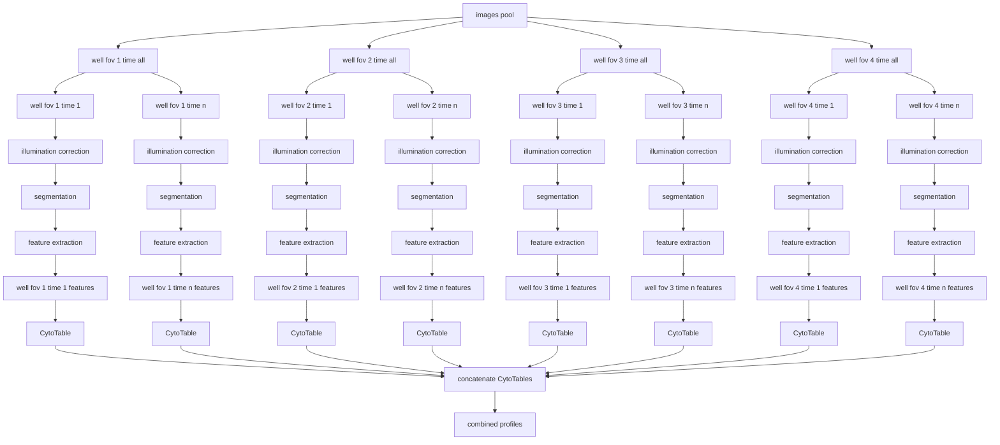

# Wave 2 Data: Live-cell time-lapse microscopy of pyroptosis.

This dataset contains live-cell time-lapse microscopy of pyroptosis in Acute Myloid Leukemia (AML) cells.
The dataset was generated by Saguaro BioSciences and University of Montreal's imaging platform in collaboration with the lab of Guy Sauvageau, PhD.

## Experimental Design
The dataset was generated by imaging AML cells that were treated with pyroptosis-inducing agents.
The cells were imaged every ~11 minutes for 20 hours using a 20x objective on a Yokogawa CQ1 cell voyager spinning disk confocal microscope.
The images were acquired with the following parameters:
* 20x objective - NA 0.80
* 56 wells on a 384-well plate
* 4 fields of view (FOV) per well
* 1 z-slice per FOV
* 5 channels

The images were acquired in 5 channels:
| Channel # | Channel Name | Excitation (nm) | Emission (nm) | Dye | Exposure (ms) |
|:---------:|:------------:|:----------:|:--------:|:------:|:---:|
| 1 | ChromaLIVE | 640 | 685/40 | ChromaLIVE | 50 |
| 2 | ChromaLIVE | 488 | 685/40 | ChromaLIVE | 200 |
| 3 | SYTOX Green | 488 | 525/50 | SYTOX Green | 50 |
| 4 | Nuclei | 405 | 447/60 | NulceoLive Blue | 50 |
| 5 | Brightfield | | | | 50 |

The wave 2 plate map can be viewed in the [Wave2_data/platemap_readme.md](./platemap_readme.md).

## Data
This wave 2 data is preliminary and generated to identify the best conditions for imaging pyroptosis in AML cells.
The data has the following naming convention:
* `{well}_{FOV}_{time}_{zslice}_{channel}.tif`
Where:
* `well` is the well number W0001 is the top left well and W0384 is the bottom right well.
The well numbers snake through the plate, so W0001 is the top left well, W0002 is the second well in the top row. W0025 is the first well in the second row, and so on.
* `FOV` is the field of view number, with F0001 being the top left FOV and FOV4 being the bottom right FOV.
* `time` is the timepoint in minutes since the start of the experiment, with T0001 being the first timepoint at 0 minutes. The timepoints are every X minutes, so T0002 is the second timepoint at X*2 minutes, and so on.
* `zslice` is the z-slice number, with Z0001 being the first z-slice.
* `channel` is the channel number, with C1 being the first channel

## Processing
### Preprocessing
These raw data are preprocessed into single well, single field of view, single timepoint, single z-slice images directories with all channels.
This allows for each FOV to be processed independently.

### Illumination Correction

### Image-based profiling

### Image-based profile processing

